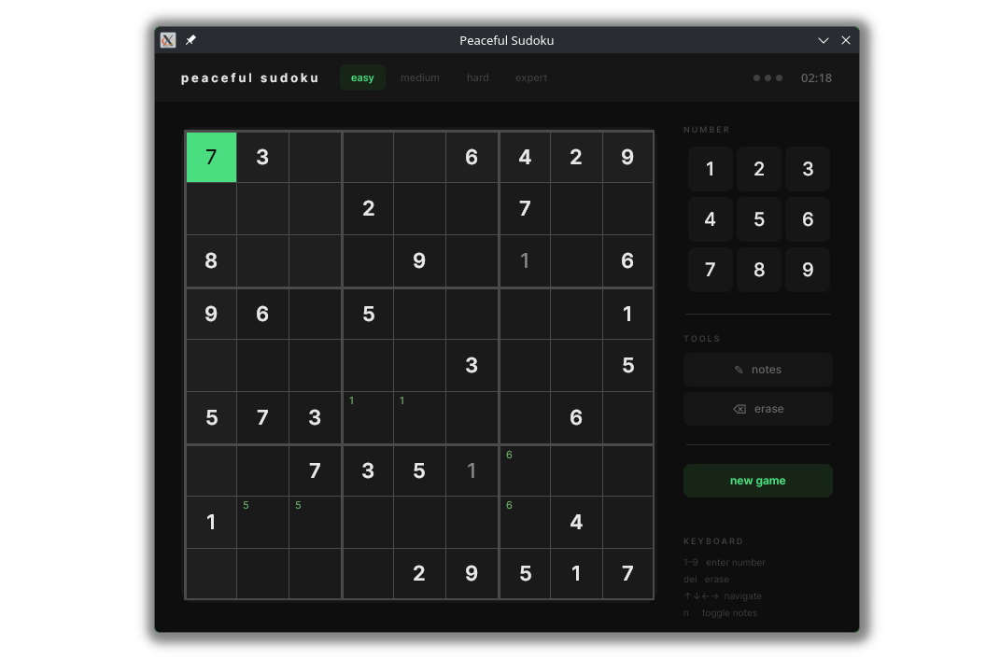

# Peaceful Sudoku

A minimalist sudoku game built with Avalonia and .NET 10. Runs on Linux and Windows.



---

## Requirements

- [.NET 10 SDK](https://dotnet.microsoft.com/download/dotnet/10.0)

---

## Run from source

```bash
git clone https://github.com/enderG4/PeacefulSudoku.git
cd PeacefulSudoku
dotnet run
```
